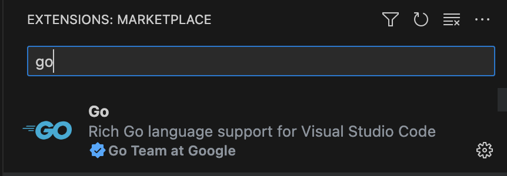
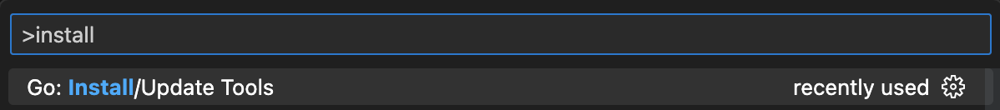
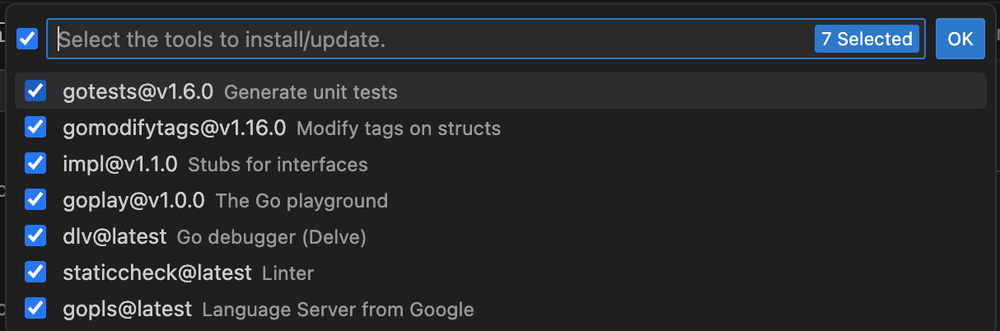

<!--{
  "Title": "Tutorial: Configure VS Code for Go Development",
  "Breadcrumb": true
}-->

With the Go extension in VS Code, you can take advantage of a wide suite of rich language support features, including Intellisense, code navigation, and debugging support. This page provides instructions on how to set up VS Code for Go development.

## Prerequisites {#prerequisites}

*   **Go**. In order to use VS Code Go you will need at least version 1.14, 
    but the latest version of Go is preferable. For installation instructions,
    see [installing Go](/doc/install).
*   **VS Code**. Download the editor [here](https://code.visualstudio.com/download)

## How to Configure VS Code for Go 

1.  **Install the VS Code Go extension**. Within VS Code, click the extensions icon and search 
    for “Go” to find the plugin. Alternatively, open the extensions search bar by pressing CTRL + SHIFT + X and search for “Go.” Install it, then open any directory or workspace containing Go code to activate it. (Alternatively: [install VS Code Go](https://marketplace.visualstudio.com/items?itemName=golang.go) from the VS Code Marketplace.)

    

    

        </img>
    

    

2.  Then, open the Command Palette (Cmd+Shift+P) and run the Go: Install/Update Tools command.

    

    

        </img>
    

    

    Then, check the “select all” option from the list of tools that just popped up, and install them all. (Note: your list may look different from the one below based on what tools you already have installed or updated in your system). Also, if you would like to see a list of all the tools on which VS Code Go depends see, the [tools documentation](https://github.com/golang/vscode-go/wiki/tools).

    

    

        </img>
    

    

3.  **Review the features of VS Code Go**.
    See the [features documentation](https://github.com/golang/vscode-go/wiki/features) to review how to use the extension’s many features, including Intellisense 
    [code completion](https://github.com/golang/vscode-go/wiki/features#code-completion), 
    [symbol lookup](https://github.com/golang/vscode-go/wiki/features#go-to-symbol), 
    [syntax highlighting](https://github.com/golang/vscode-go/wiki/features#go-template-syntax-highlighting), and more.

4.  **Customize your settings**.  If you wish to further customize the VS Code Go extension, 
    review the [settings documentation](https://github.com/golang/vscode-go/wiki/settings) and choose how you would like to update your settings. You can do so by either changing your settings.json file directly (open the command palette and search for “settings”), or you can navigate to Code > Preferences > Settings. See [how to change the settings](https://code.visualstudio.com/docs/getstarted/settings) in your workspace, and check the detailed [list of settings](https://github.com/golang/vscode-go/wiki/settings) to learn what you can configure. Some popular settings you can modify include:

    *   [go.addTags](https://github.com/golang/vscode-go/wiki/settings#goaddtags) to add tags to struct fields.
    *   [go.converageDecorator](https://github.com/golang/vscode-go/wiki/settings#gocoveragedecorator) to change the display of code coverage (customize colors, gutters, highlighting, etc).
    *   [Ui.diagnostics.analyses](https://github.com/golang/vscode-go/wiki/settings#uidiagnosticanalyses) to enable or disable various analysis passes.

5.  **Consult further resources**. For assistance with any other type of customization, 
    or for guidance on other issues, start with the following resources:

    *   [Documentation](https://github.com/golang/vscode-go/wiki/advanced) on advanced VS Code Go techniques
    *   [Troubleshooting steps](https://github.com/golang/vscode-go/wiki/troubleshooting) for VS Code Go
    *   [Github Discussions](https://github.com/golang/vscode-go/discussions) on VS Code Go
    *   [Stack Overflow](https://stackoverflow.com/questions/tagged/go+visual-studio-code) ​​“VS Code Go” tag
    *   [YouTube video](https://www.youtube.com/watch?v=1MXIGYrMk80&feature=youtu.be) on how to build your first application with VS Code Go
