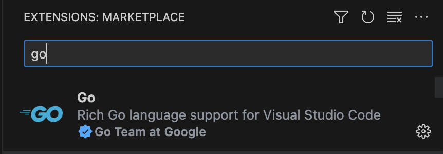
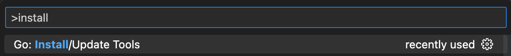
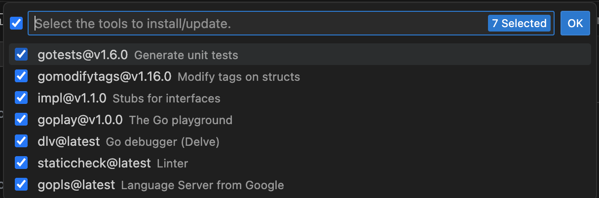

<!--{
  "Title": "Tutorial: Configure VS Code for Go Development",
  "Breadcrumb": true
}-->

The VS Code Go extension provides a suite of rich language support features, including 
[Intellisense](https://github.com/golang/vscode-go/wiki/features#intellisense),
[code navigation](https://github.com/golang/vscode-go/wiki/features#code-navigation),
[code editing](https://github.com/golang/vscode-go/wiki/features#code-editing), 
[diagnostics](https://github.com/golang/vscode-go/wiki/features#code-navigation), 
[testing](https://github.com/golang/vscode-go/wiki/features#run-and-test-in-the-editor) and 
[debugging](https://github.com/golang/vscode-go/wiki/debugging#features) support. 
This page provides instructions on how to set up VS Code for Go development.

## Prerequisites {#prerequisites}

*   **Go**. VS Code Go requires Go version 1.14 or higher, but the latest version of Go is recommended. For installation instructions, see [Installing Go](/doc/install).
*   **VS Code**.Download the editor [here](https://code.visualstudio.com/download).

## How to Configure VS Code for Go 

1.  **Install the VS Code Go extension**, open VS Code and click the extensions icon. Search for "Go" and click the Install button. 
    Alternatively, open the extensions search bar using the shortcut CTRL + SHIFT + X and search for “Go”. Click to install it. Once installed, open any directory or workspace containing Go code to activate the extension. (Alternatively: [Install VS Code Go](https://marketplace.visualstudio.com/items?itemName=golang.go) from the VS Code Marketplace.)

    

    

        </img>
    

    

2.  Open the Command Palette (Cmd+Shift+P) and run the Go: Install/Update Tools command.

    

    

        </img>
    

    

    Check the “select all” option from the list of tools that just popped up, and click “OK” to install them. (Note: Your list may look different from the one below, depending on which tools you already have installed or updated on your system.) For a list of all the tools that VS Code Go depends on, see the [tools documentation](https://github.com/golang/vscode-go/wiki/tools).

    

    

        </img>
    

    

3.  **Learn more about the features of VS Code Go** by referring to 
    [features documentation](https://github.com/golang/vscode-go/wiki/features), which will provide insights into how to use 
    the extension’s many features, including Intellisense [code completion](https://github.com/golang/vscode-go/wiki/features), 
    [symbol lookup](https://github.com/golang/vscode-go/wiki/features#go-to-symbol), 
    [syntax highlighting](https://github.com/golang/vscode-go/wiki/features#go-template-syntax-highlighting), and more. 

4.  **Customize your settings**.  To further customize the VS Code Go extension, refer to 
    the [settings documentation](https://github.com/golang/vscode-go/wiki/settings) to update the settings.
    It can be done by either changing the settings.json file directly (open the command palette and search for “settings”), or navigating to Code > Preferences > Settings. See [how to change the settings](https://code.visualstudio.com/docs/getstarted/settings) in the workspace, and browse the detailed [list of settings](https://github.com/golang/vscode-go/wiki/settings) to learn what can be configured.
    Some popular settings to modify include:

    *   [go.addTags](https://github.com/golang/vscode-go/wiki/settings#goaddtags) to add tags to struct fields.
    *   [go.converageDecorator](https://github.com/golang/vscode-go/wiki/settings#gocoveragedecorator) to change the display of code coverage (customize colors, gutters, highlighting, etc).
    *   [Ui.diagnostics.analyses](https://github.com/golang/vscode-go/wiki/settings#uidiagnosticanalyses) to enable or disable various analysis passes.

5.  **Additional resources**. For more help with customization or other issues, see the following resources:

    *   [Documentation](https://github.com/golang/vscode-go/wiki/advanced) on advanced VS Code Go techniques
    *   [Troubleshooting steps](https://github.com/golang/vscode-go/wiki/troubleshooting) for VS Code Go
    *   [Github Discussions](https://github.com/golang/vscode-go/discussions) on VS Code Go
    *   [Stack Overflow](https://stackoverflow.com/questions/tagged/go+visual-studio-code) ​​“VS Code Go” tag
    *   [YouTube video](https://www.youtube.com/watch?v=1MXIGYrMk80&feature=youtu.be) on how to build your first application with VS Code Go
